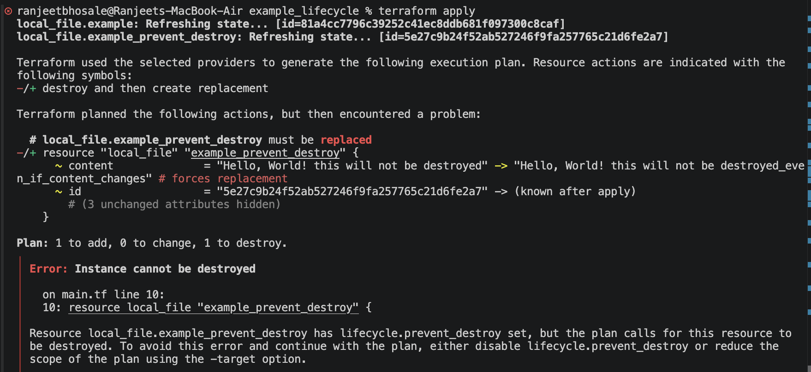

# ☁️ TerraWeek Day 3 — Providers, Resources & Your First Cloud Infra

**Date:** Tuesday, 14th July 2026

Time to touch **real cloud infrastructure**! Today you'll configure a **provider**, use **data sources** and **meta-arguments** (`for_each`, `count`, `depends_on`, `lifecycle`), and provision a small network + compute stack on the cloud of your choice. 🏗️

---

## 🎯 Learning Goals

- Configure a **provider** properly with **version pinning** and **region**.
- Understand **resources** vs **data sources**.
- Use meta-arguments: **`count`**, **`for_each`**, **`depends_on`**, **`lifecycle`**.
- Provision, update, and destroy real cloud resources safely.

---

## ⚙️ Setup: Authenticate Your Cloud

Pick **one** provider and configure its CLI (never hard-code credentials in `.tf` files!):

- **AWS** → `aws configure` (uses `~/.aws/credentials`) — provider `hashicorp/aws ~> 6.0`
- **Azure** → `az login` — provider `hashicorp/azurerm ~> 4.0`
- **GCP** → `gcloud auth application-default login` — provider `hashicorp/google ~> 6.0`
- **Utho** → API token env var — provider `uthoplatforms/utho`

---

## 🗺️ 60-Second Networking Primer (read this first!)

Today jumps from a single container to a real cloud network. Don't panic — here are the **6 building blocks** you'll create, in plain English:

| Block | What it is | Real-world analogy |
|-------|------------|--------------------|
| **VPC** | Your own private, isolated network in the cloud (a range of IPs like `10.0.0.0/16`) | Your own gated neighborhood |
| **Subnet** | A slice of the VPC's IPs (`10.0.1.0/24`), lives in one Availability Zone | A street in that neighborhood |
| **Internet Gateway (IGW)** | The door between your VPC and the public internet | The neighborhood's main gate |
| **Route Table** | Rules that say "traffic for the internet → go via the IGW" | Road signs / GPS routes |
| **Security Group (SG)** | A stateful virtual firewall on the instance (which ports are open) | A bouncer checking who gets in |
| **EC2 Instance** | The actual virtual machine running your app | A house on the street |

**How they connect:** an **EC2 instance** lives in a **subnet**, inside a **VPC**. To reach the internet, the subnet's **route table** sends traffic through the **IGW**, and the **security group** decides which ports (e.g. 80/HTTP) are allowed in.

```
Internet ──▶ [IGW] ──▶ [Route Table] ──▶ [ Public Subnet ] ──▶ [SG] ──▶ [EC2]
                                          (inside the VPC)
```

> 💡 You'll build exactly this stack in Task 3. Re-read this table if a resource name ever feels confusing.

---

## 📝 Tasks

### Task 1: Providers & Version Pinning
- Add a `terraform` block with `required_version` and `required_providers` (pin with `~>`).
<br>

- Explain **why version pinning matters** and what the `~>` (pessimistic) operator does.
<br>Version pinning locks your software to specific dependency versions.
<br>It Locks software to specific dependency versions. It ensures build stability, repeatability, and security across different environments (local development vs. production) by preventing unexpected upstream updates.
<br>~> operator locks upto specific minor releases without upgrading to version higher than that. 
<br>1. Three-Digit Specification (Patch Lock)
* **Format:** `~> X.Y.Z` (e.g., `~> 2.1.0`)
* **Behavior:** Locks the major and minor versions. Only the patch version varies.
* **Range:** `>= 2.1.0` and `< 2.2.0`
* **Examples:** Installs `2.1.1` or `2.1.9`, but blocks `2.2.0`.
<br>Two-Digit Specification (Minor Lock)
* **Format:** `~> X.Y` (e.g., `~> 2.1`)
* **Behavior:** Locks the major version. The minor and patch versions vary.
* **Range:** `>= 2.1` and `< 3.0`
* **Examples:** Installs `2.2.0` or `2.5.1`, but blocks `3.0.0`.

- **Bonus:** configure a second provider **alias** (e.g. a second AWS region) and explain when you'd use it.
<br>

### Task 2: Resources vs Data Sources
- Create at least one **resource** (something new).
- Use at least one **`data`** source to *read* existing info (e.g. `aws_ami`, `aws_availability_zones`, or your default VPC).
- Explain the difference: **resources create/manage**, **data sources only read**.

<br>Terraform: Resources vs. Data Sources

1. Resources (`resource`)
* **Purpose**: **Write & Manage**. Used to create, update, and delete infrastructure.
* **State**: Tracked in `terraform.tfstate`. Terraform controls its entire lifecycle.
* **Example**: Creating a brand new AWS S3 bucket or EC2 instance.

2. Data Sources (`data`)
* **Purpose**: **Read-Only**. Used to fetch information from existing infrastructure outside the current configuration.
* **State**: Not managed by Terraform. Safe to run as it makes zero infrastructure changes.
* **Example**: Querying AWS to get the latest Ubuntu AMI ID or looking up an existing VPC ID.

Code Syntax Example

```hcl
# READ: Fetches existing VPC information by its tag
data "aws_vpc" "existing_vpc" {
  filter {
    name   = "tag:Name"
    values = ["production-vpc"]
  }
}

# WRITE: Creates a new subnet inside that existing VPC
resource "aws_subnet" "new_subnet" {
  vpc_id     = data.aws_vpc.existing_vpc.id # Reference data source output
  cidr_block = "10.0.1.0/24"
}
```

### Task 3: Provision a Cloud Stack
Use the **AWS starter code in [`./example`](./example)** (or adapt to Azure/GCP). It builds a minimal, free-tier-friendly stack:
- a **VPC** + **public subnet** + **internet gateway** + **route table**
- a **security group**
- an **EC2 instance** using a **data source** to find the latest Amazon Linux 2023 AMI


cd example
terraform init
```text
Initializing the backend...

Initializing provider plugins...
- Finding hashicorp/aws versions matching "~> 6.0"...
- Installing hashicorp/aws v6.55.0...
- Installed hashicorp/aws v6.55.0 (signed by HashiCorp)

Terraform has created a lock file .terraform.lock.hcl to record the provider
selections it made above. Include this file in your version control repository
so that Terraform can guarantee to make the same selections by default when
you run "terraform init" in the future.

Terraform has been successfully initialized!

You may now begin working with Terraform. Try running "terraform plan" to see
any changes that are required for your infrastructure. All Terraform commands
should now work.

If you ever set or change modules or backend configuration for Terraform,
rerun this command to reinitialize your working directory. If you forget, other
commands will detect it and remind you to do so if necessary.
```
terraform validate
```text
Success! The configuration is valid.
```
terraform plan
```text
data.aws_ami.al2023: Reading...
data.aws_availability_zones.available: Reading...
aws_vpc.main: Refreshing state... [id=vpc-0c80ece1b08345982]
data.aws_availability_zones.available: Read complete after 1s [id=us-east-1]
data.aws_ami.al2023: Read complete after 2s [id=ami-0fd6240f599091088]
aws_internet_gateway.igw: Refreshing state... [id=igw-02f71846055c2bf30]
aws_subnet.public: Refreshing state... [id=subnet-03d46d50fcbf3a512]
aws_security_group.web: Refreshing state... [id=sg-07bd746ffcc9a7a4c]
aws_route_table.public: Refreshing state... [id=rtb-034fff886fa0f35db]
aws_route_table_association.public: Refreshing state... [id=rtbassoc-0f262d2ca18bfaede]

Terraform used the selected providers to generate the following execution plan. Resource actions are indicated with the following symbols:
  + create

Terraform will perform the following actions:

  # aws_instance.web will be created
  + resource "aws_instance" "web" {
      + ami                                  = "ami-0fd6240f599091088"
      + arn                                  = (known after apply)
      + associate_public_ip_address          = (known after apply)
      + availability_zone                    = (known after apply)
      + disable_api_stop                     = (known after apply)
      + disable_api_termination              = (known after apply)
      + ebs_optimized                        = (known after apply)
      + enable_primary_ipv6                  = (known after apply)
      + force_destroy                        = false
      + get_password_data                    = false
      + host_id                              = (known after apply)
      + host_resource_group_arn              = (known after apply)
      + iam_instance_profile                 = (known after apply)
      + id                                   = (known after apply)
      + instance_initiated_shutdown_behavior = (known after apply)
      + instance_lifecycle                   = (known after apply)
      + instance_state                       = (known after apply)
      + instance_type                        = "t3.micro"
      + ipv6_address_count                   = (known after apply)
      + ipv6_addresses                       = (known after apply)
      + key_name                             = (known after apply)
      + monitoring                           = (known after apply)
      + outpost_arn                          = (known after apply)
      + password_data                        = (known after apply)
      + placement_group                      = (known after apply)
      + placement_group_id                   = (known after apply)
      + placement_partition_number           = (known after apply)
      + primary_network_interface_id         = (known after apply)
      + private_dns                          = (known after apply)
      + private_ip                           = (known after apply)
      + public_dns                           = (known after apply)
      + public_ip                            = (known after apply)
      + region                               = "us-east-1"
      + secondary_private_ips                = (known after apply)
      + security_groups                      = (known after apply)
      + source_dest_check                    = true
      + spot_instance_request_id             = (known after apply)
      + subnet_id                            = "subnet-03d46d50fcbf3a512"
      + tags                                 = {
          + "Name" = "terraweek-web"
        }
      + tags_all                             = {
          + "Day"       = "03"
          + "ManagedBy" = "terraform"
          + "Name"      = "terraweek-web"
          + "Project"   = "terraweek-2026"
        }
      + tenancy                              = (known after apply)
      + user_data                            = <<-EOT
            #!/bin/bash
            dnf install -y nginx
            echo "<h1>Hello from TerraWeek 2026 🚀</h1>" > /usr/share/nginx/html/index.html
            systemctl enable --now nginx
        EOT
      + user_data_base64                     = (known after apply)
      + user_data_replace_on_change          = false
      + vpc_security_group_ids               = [
          + "sg-07bd746ffcc9a7a4c",
        ]

      + capacity_reservation_specification (known after apply)

      + cpu_options (known after apply)

      + ebs_block_device (known after apply)

      + enclave_options (known after apply)

      + ephemeral_block_device (known after apply)

      + instance_market_options (known after apply)

      + maintenance_options (known after apply)

      + metadata_options (known after apply)

      + network_interface (known after apply)

      + primary_network_interface (known after apply)

      + private_dns_name_options (known after apply)

      + root_block_device (known after apply)

      + secondary_network_interface (known after apply)
    }

Plan: 1 to add, 0 to change, 0 to destroy.

Changes to Outputs:
  + instance_id = (known after apply)
  + public_ip   = (known after apply)
  + web_url     = (known after apply)

──────────────────────────────────────────────────────────────────────────────────────────────────────────────────────────────────────────────────────────

Note: You didn't use the -out option to save this plan, so Terraform can't guarantee to take exactly these actions if you run "terraform apply" now.
```
terraform apply      # type: yes
```text
ata.aws_availability_zones.available: Reading...
data.aws_ami.al2023: Reading...
aws_vpc.main: Refreshing state... [id=vpc-0c80ece1b08345982]
data.aws_availability_zones.available: Read complete after 1s [id=us-east-1]
data.aws_ami.al2023: Read complete after 2s [id=ami-0fd6240f599091088]
aws_internet_gateway.igw: Refreshing state... [id=igw-02f71846055c2bf30]
aws_subnet.public: Refreshing state... [id=subnet-03d46d50fcbf3a512]
aws_security_group.web: Refreshing state... [id=sg-07bd746ffcc9a7a4c]
aws_route_table.public: Refreshing state... [id=rtb-034fff886fa0f35db]
aws_route_table_association.public: Refreshing state... [id=rtbassoc-0f262d2ca18bfaede]

Terraform used the selected providers to generate the following execution plan. Resource actions are indicated with the following symbols:
  + create

Terraform will perform the following actions:

  # aws_instance.web will be created
  + resource "aws_instance" "web" {
      + ami                                  = "ami-0fd6240f599091088"
      + arn                                  = (known after apply)
      + associate_public_ip_address          = (known after apply)
      + availability_zone                    = (known after apply)
      + disable_api_stop                     = (known after apply)
      + disable_api_termination              = (known after apply)
      + ebs_optimized                        = (known after apply)
      + enable_primary_ipv6                  = (known after apply)
      + force_destroy                        = false
      + get_password_data                    = false
      + host_id                              = (known after apply)
      + host_resource_group_arn              = (known after apply)
      + iam_instance_profile                 = (known after apply)
      + id                                   = (known after apply)
      + instance_initiated_shutdown_behavior = (known after apply)
      + instance_lifecycle                   = (known after apply)
      + instance_state                       = (known after apply)
      + instance_type                        = "t3.micro"
      + ipv6_address_count                   = (known after apply)
      + ipv6_addresses                       = (known after apply)
      + key_name                             = (known after apply)
      + monitoring                           = (known after apply)
      + outpost_arn                          = (known after apply)
      + password_data                        = (known after apply)
      + placement_group                      = (known after apply)
      + placement_group_id                   = (known after apply)
      + placement_partition_number           = (known after apply)
      + primary_network_interface_id         = (known after apply)
      + private_dns                          = (known after apply)
      + private_ip                           = (known after apply)
      + public_dns                           = (known after apply)
      + public_ip                            = (known after apply)
      + region                               = "us-east-1"
      + secondary_private_ips                = (known after apply)
      + security_groups                      = (known after apply)
      + source_dest_check                    = true
      + spot_instance_request_id             = (known after apply)
      + subnet_id                            = "subnet-03d46d50fcbf3a512"
      + tags                                 = {
          + "Name" = "terraweek-web"
        }
      + tags_all                             = {
          + "Day"       = "03"
          + "ManagedBy" = "terraform"
          + "Name"      = "terraweek-web"
          + "Project"   = "terraweek-2026"
        }
      + tenancy                              = (known after apply)
      + user_data                            = <<-EOT
            #!/bin/bash
            dnf install -y nginx
            echo "<h1>Hello from TerraWeek 2026 🚀</h1>" > /usr/share/nginx/html/index.html
            systemctl enable --now nginx
        EOT
      + user_data_base64                     = (known after apply)
      + user_data_replace_on_change          = false
      + vpc_security_group_ids               = [
          + "sg-07bd746ffcc9a7a4c",
        ]

      + capacity_reservation_specification (known after apply)

      + cpu_options (known after apply)

      + ebs_block_device (known after apply)

      + enclave_options (known after apply)

      + ephemeral_block_device (known after apply)

      + instance_market_options (known after apply)

      + maintenance_options (known after apply)

      + metadata_options (known after apply)

      + network_interface (known after apply)

      + primary_network_interface (known after apply)

      + private_dns_name_options (known after apply)

      + root_block_device (known after apply)

      + secondary_network_interface (known after apply)
    }

Plan: 1 to add, 0 to change, 0 to destroy.

Changes to Outputs:
  + instance_id = (known after apply)
  + public_ip   = (known after apply)
  + web_url     = (known after apply)

Do you want to perform these actions?
  Terraform will perform the actions described above.
  Only 'yes' will be accepted to approve.

  Enter a value: yes

aws_instance.web: Creating...
aws_instance.web: Still creating... [00m10s elapsed]
aws_instance.web: Creation complete after 17s [id=i-0c1f5f0f48bf02d44]

Apply complete! Resources: 1 added, 0 changed, 0 destroyed.

Outputs:

ami_id = "ami-0fd6240f599091088"
instance_id = "i-0c1f5f0f48bf02d44"
public_ip = "98.86.174.213"
web_url = "http://98.86.174.213"
```
terraform state list # see everything Terraform now manages
```text
ranjeetbhosale@Ranjeets-MacBook-Air example % terraform state list
data.aws_ami.al2023
data.aws_availability_zones.available
aws_instance.web
aws_internet_gateway.igw
aws_route_table.public
aws_route_table_association.public
aws_security_group.web
aws_subnet.public
aws_vpc.main
```

### Task 4: Meta-Arguments in Action
Extend the config to practice each of these:
- **`count`** — create N identical resources (e.g. N EC2 instances).
<br>Added code to count = 2 as below with changes in outputs.tf and main.tf(Name = "${var.name_prefix}-web-${count.index + 1}")
<br>

```diff
diff --git a/day03/example/main.tf b/day03/example/main.tf
index 6cf9b44..0e698ba 100644
--- a/day03/example/main.tf
+++ b/day03/example/main.tf
@@ -105,10 +105,10 @@ resource "aws_security_group" "web" {
 
 resource "aws_instance" "web" {
   ami                    = data.aws_ami.al2023.id
-  count                  = 2
   instance_type          = var.instance_type
   subnet_id              = aws_subnet.public.id
   vpc_security_group_ids = [aws_security_group.web.id]
+  associate_public_ip_address = true
 
   user_data = <<-EOF
     #!/bin/bash
@@ -122,6 +122,6 @@ resource "aws_instance" "web" {
   }
 
   tags = {
-    Name = "${var.name_prefix}-web"
+    Name = "${var.name_prefix}-web-${count.index + 1}"
   }
 }
diff --git a/day03/example/outputs.tf b/day03/example/outputs.tf
index c25bf60..ddd5b32 100644
--- a/day03/example/outputs.tf
+++ b/day03/example/outputs.tf
@@ -1,16 +1,16 @@
-output "instance_id" {
-  description = "ID of the EC2 instance."
-  value       = aws_instance.web.id
+output "instance_ids" {
+  description = "IDs of all EC2 instances."
+  value       = aws_instance.web[*].id
 }
 
-output "public_ip" {
-  description = "Public IP of the web server."
-  value       = aws_instance.web.public_ip
+output "public_ips" {
+  description = "Public IPs of the web servers."
+  value       = aws_instance.web[*].public_ip
 }
 
-output "web_url" {
-  description = "Open this in your browser once the instance boots."
-  value       = "http://${aws_instance.web.public_ip}"
+output "web_urls" {
+  description = "URLs to access the web servers."
+  value       = [for ip in aws_instance.web[*].public_ip : "http://${ip}"]
 }
```

- **`for_each`** — create resources from a `map`/`set` (preferred over `count` for named things).
<br>Added in day03/example_for
- **`depends_on`** — force an explicit ordering.
<br>Code for depends_on added in day03/example_depends_on, demonstrated EC2 instance depends on AWS SG.
<br>Dependency graph is as:


- **`lifecycle`** — try `create_before_destroy`, `prevent_destroy`, and `ignore_changes`
**create_before_destroy**
<br>terraform apply output for create_before_destroy is as:
<br>Here first example.txt with content "Hello, World! with changes in lifecycle" was created
<br>later its content was changed to "Hello, World! with changes in lifecycle2"


**prevent_destroy**
<br>Terraform apply output for prevent destroy


<br>File not be deleted even if marked for destroy in terraform apply



<br>File not be deleted during terraform destroy


```hcl
lifecycle {
  create_before_destroy = true
  ignore_changes        = [tags["LastModified"]]
}
```

### Task 5: Update & Destroy
- Change a `tag` or the `instance_type`, run `terraform plan`, and read the diff — notice what forces 
<br>Terraform plan output after tag change, it is in-place update change where Terraform calls CreateTags and existing resource will not be deleted.

```diff
ranjeetbhosale@Ranjeets-MacBook-Air example_depends_on % terraform plan
data.aws_availability_zones.available: Reading...
data.aws_ami.al2023: Reading...
aws_security_group.web: Refreshing state... [id=sg-012db8010c4b40411]
data.aws_availability_zones.available: Read complete after 1s [id=us-east-1]
data.aws_ami.al2023: Read complete after 2s [id=ami-0fd6240f599091088]
aws_instance.web: Refreshing state... [id=i-04876adad823e0070]

Terraform used the selected providers to generate the following execution plan. Resource actions are indicated with the
following symbols:
  ~ update in-place

Terraform will perform the following actions:

  # aws_instance.web will be updated in-place
  ~ resource "aws_instance" "web" {
        id                                   = "i-04876adad823e0070"
      ~ tags                                 = {
          ~ "Name" = "terraweek" -> "terraweek-tag-changes"
        }
      ~ tags_all                             = {
          ~ "Name"      = "terraweek" -> "terraweek-tag-changes"
            # (3 unchanged elements hidden)
        }
        # (40 unchanged attributes hidden)

        # (9 unchanged blocks hidden)
    }

Plan: 0 to add, 1 to change, 0 to destroy.
```
<br>screenshot of tag changes, instance will not be deleted.


<br>Terraform plan output for instance change
<br>Terraform plan output after instance type change, it is also in-place update change where Terraform calls ModifyInstanceAttribute and existing resource will be temporarily stopped and new instance type will be assigned. Instance ID, private IP, and EBS volumes remain exactly the same

```diff
ranjeetbhosale@Ranjeets-MacBook-Air example_depends_on % terraform plan 
data.aws_availability_zones.available: Reading...
data.aws_ami.al2023: Reading...
aws_security_group.web: Refreshing state... [id=sg-012db8010c4b40411]
data.aws_availability_zones.available: Read complete after 1s [id=us-east-1]
data.aws_ami.al2023: Read complete after 1s [id=ami-0fd6240f599091088]
aws_instance.web: Refreshing state... [id=i-04876adad823e0070]

Terraform used the selected providers to generate the following execution plan. Resource actions are indicated with the
following symbols:
  ~ update in-place

Terraform will perform the following actions:

  # aws_instance.web will be updated in-place
  ~ resource "aws_instance" "web" {
        id                                   = "i-04876adad823e0070"
      ~ instance_type                        = "t3.micro" -> "t2.micro"
      ~ public_dns                           = "ec2-32-196-143-93.compute-1.amazonaws.com" -> (known after apply)
      ~ public_ip                            = "32.196.143.93" -> (known after apply)
        tags                                 = {
            "Name" = "terraweek-tag-changes"
        }
        # (38 unchanged attributes hidden)

        # (9 unchanged blocks hidden)
    }

Plan: 0 to add, 1 to change, 0 to destroy.

Changes to Outputs:
  ~ public_ips   = "32.196.143.93" -> (known after apply)
  ~ web_urls     = "http://32.196.143.93" -> (known after apply)

─────────────────────────────────────────────────────────────────────────────────────────────────────────────────────────

Note: You didn't use the -out option to save this plan, so Terraform can't guarantee to take exactly these actions if you
run "terraform apply" now.
ranjeetbhosale@Ranjeets-MacBook-Air example_depends_on %
```


**replace** vs **in-place update**.
<br>replace - here existing resource will be deleted and new resource will be creating e.g. AMI ID of the instance is changed, new instance will be created.
<br>sample plan output when AMI is changed is as:

```diff
ranjeetbhosale@Ranjeets-MacBook-Air example_depends_on % terraform plan 
data.aws_availability_zones.available: Reading...
data.aws_ami.ubuntu: Reading...
aws_security_group.web: Refreshing state... [id=sg-012db8010c4b40411]
data.aws_availability_zones.available: Read complete after 1s [id=us-east-1]
data.aws_ami.ubuntu: Read complete after 2s [id=ami-052355af2a014bd2c]
aws_instance.web: Refreshing state... [id=i-04876adad823e0070]

Terraform used the selected providers to generate the following execution plan. Resource actions are indicated with the
following symbols:
+/- create replacement and then destroy

Terraform will perform the following actions:

  # aws_instance.web must be replaced
+/- resource "aws_instance" "web" {
      ~ ami                                  = "ami-0fd6240f599091088" -> "ami-052355af2a014bd2c" # forces replacement
      ~ arn                                  = "arn:aws:ec2:us-east-1:899805259876:instance/i-04876adad823e0070" -> (known after apply)
      ~ disable_api_stop                     = false -> (known after apply)
      ~ disable_api_termination              = false -> (known after apply)
      ~ ebs_optimized                        = false -> (known after apply)
      + enable_primary_ipv6                  = (known after apply)
      - hibernation                          = false -> null
      + host_id                              = (known after apply)
      + host_resource_group_arn              = (known after apply)
      + iam_instance_profile                 = (known after apply)
      ~ id                                   = "i-04876adad823e0070" -> (known after apply)
      ~ instance_initiated_shutdown_behavior = "stop" -> (known after apply)
      + instance_lifecycle                   = (known after apply)
      ~ instance_state                       = "running" -> (known after apply)
      ~ ipv6_address_count                   = 0 -> (known after apply)
      ~ ipv6_addresses                       = [] -> (known after apply)
      + key_name                             = (known after apply)
      ~ monitoring                           = false -> (known after apply)
      + outpost_arn                          = (known after apply)
      + password_data                        = (known after apply)
      + placement_group                      = (known after apply)
      + placement_group_id                   = (known after apply)
      ~ placement_partition_number           = 0 -> (known after apply)
      ~ primary_network_interface_id         = "eni-0742983891cbd86bc" -> (known after apply)
      ~ private_dns                          = "ip-172-31-5-146.ec2.internal" -> (known after apply)
      ~ private_ip                           = "172.31.5.146" -> (known after apply)
      ~ public_dns                           = "ec2-32-196-143-93.compute-1.amazonaws.com" -> (known after apply)
      ~ public_ip                            = "32.196.143.93" -> (known after apply)
      ~ secondary_private_ips                = [] -> (known after apply)
      ~ security_groups                      = [
          - "terraweek-web-sg",
        ] -> (known after apply)
      + spot_instance_request_id             = (known after apply)
      ~ subnet_id                            = "subnet-0b74503713cdcbc36" -> (known after apply)
        tags                                 = {
            "Name" = "terraweek-tag-changes"
        }
      ~ tenancy                              = "default" -> (known after apply)
      + user_data_base64                     = (known after apply)
        # (11 unchanged attributes hidden)

      ~ capacity_reservation_specification (known after apply)
      - capacity_reservation_specification {
          - capacity_reservation_preference = "open" -> null
        }

      ~ cpu_options (known after apply)
      - cpu_options {
          - core_count            = 1 -> null
          - threads_per_core      = 2 -> null
            # (2 unchanged attributes hidden)
        }

      - credit_specification {
          - cpu_credits = "unlimited" -> null
        }

      ~ ebs_block_device (known after apply)

      ~ enclave_options (known after apply)
      - enclave_options {
          - enabled = false -> null
        }

      ~ ephemeral_block_device (known after apply)

      ~ instance_market_options (known after apply)

      ~ maintenance_options (known after apply)
      - maintenance_options {
          - auto_recovery = "default" -> null
        }

      ~ metadata_options (known after apply)
      - metadata_options {
          - http_endpoint               = "enabled" -> null
          - http_protocol_ipv6          = "disabled" -> null
          - http_put_response_hop_limit = 2 -> null
          - http_tokens                 = "required" -> null
          - instance_metadata_tags      = "disabled" -> null
        }

      ~ network_interface (known after apply)

      ~ primary_network_interface (known after apply)
      - primary_network_interface {
          - delete_on_termination = true -> null
          - network_interface_id  = "eni-0742983891cbd86bc" -> null
        }

      ~ private_dns_name_options (known after apply)
      - private_dns_name_options {
          - enable_resource_name_dns_a_record    = false -> null
          - enable_resource_name_dns_aaaa_record = false -> null
          - hostname_type                        = "ip-name" -> null
        }

      ~ root_block_device (known after apply)
      - root_block_device {
          - delete_on_termination = true -> null
          - device_name           = "/dev/xvda" -> null
          - encrypted             = false -> null
          - iops                  = 3000 -> null
          - tags                  = {
              - "Day"       = "03"
              - "ManagedBy" = "terraform"
              - "Project"   = "terraweek-2026"
            } -> null
          - tags_all              = {
              - "Day"       = "03"
              - "ManagedBy" = "terraform"
              - "Project"   = "terraweek-2026"
            } -> null
          - throughput            = 125 -> null
          - volume_id             = "vol-0ba9c5c8b0631f284" -> null
          - volume_size           = 8 -> null
          - volume_type           = "gp3" -> null
            # (1 unchanged attribute hidden)
        }

      ~ secondary_network_interface (known after apply)
    }

Plan: 1 to add, 0 to change, 1 to destroy.

Changes to Outputs:
  ~ ami_id       = "ami-0fd6240f599091088" -> "ami-052355af2a014bd2c"
  ~ instance_ids = "i-04876adad823e0070" -> (known after apply)
  ~ public_ips   = "32.196.143.93" -> (known after apply)
  ~ web_urls     = "http://32.196.143.93" -> (known after apply)

─────────────────────────────────────────────────────────────────────────────────────────────────────────────────────────

Note: You didn't use the -out option to save this plan, so Terraform can't guarantee to take exactly these actions if you
run "terraform apply" now.
```

<br>Terraform apply output for instance destroy and new created is as:

```diff
ranjeetbhosale@Ranjeets-MacBook-Air example_depends_on % terraform apply
data.aws_availability_zones.available: Reading...
data.aws_ami.ubuntu: Reading...
aws_security_group.web: Refreshing state... [id=sg-012db8010c4b40411]
data.aws_availability_zones.available: Read complete after 1s [id=us-east-1]
data.aws_ami.ubuntu: Read complete after 1s [id=ami-052355af2a014bd2c]
aws_instance.web: Refreshing state... [id=i-04876adad823e0070]

Terraform used the selected providers to generate the following execution plan. Resource actions are indicated with the
following symbols:
+/- create replacement and then destroy

Terraform will perform the following actions:

  # aws_instance.web must be replaced
+/- resource "aws_instance" "web" {
      ~ ami                                  = "ami-0fd6240f599091088" -> "ami-052355af2a014bd2c" # forces replacement
      ~ arn                                  = "arn:aws:ec2:us-east-1:899805259876:instance/i-04876adad823e0070" -> (known after apply)
      ~ disable_api_stop                     = false -> (known after apply)
      ~ disable_api_termination              = false -> (known after apply)
      ~ ebs_optimized                        = false -> (known after apply)
      + enable_primary_ipv6                  = (known after apply)
      - hibernation                          = false -> null
      + host_id                              = (known after apply)
      + host_resource_group_arn              = (known after apply)
      + iam_instance_profile                 = (known after apply)
      ~ id                                   = "i-04876adad823e0070" -> (known after apply)
      ~ instance_initiated_shutdown_behavior = "stop" -> (known after apply)
      + instance_lifecycle                   = (known after apply)
      ~ instance_state                       = "running" -> (known after apply)
      ~ ipv6_address_count                   = 0 -> (known after apply)
      ~ ipv6_addresses                       = [] -> (known after apply)
      + key_name                             = (known after apply)
      ~ monitoring                           = false -> (known after apply)
      + outpost_arn                          = (known after apply)
      + password_data                        = (known after apply)
      + placement_group                      = (known after apply)
      + placement_group_id                   = (known after apply)
      ~ placement_partition_number           = 0 -> (known after apply)
      ~ primary_network_interface_id         = "eni-0742983891cbd86bc" -> (known after apply)
      ~ private_dns                          = "ip-172-31-5-146.ec2.internal" -> (known after apply)
      ~ private_ip                           = "172.31.5.146" -> (known after apply)
      ~ public_dns                           = "ec2-32-196-143-93.compute-1.amazonaws.com" -> (known after apply)
      ~ public_ip                            = "32.196.143.93" -> (known after apply)
      ~ secondary_private_ips                = [] -> (known after apply)
      ~ security_groups                      = [
          - "terraweek-web-sg",
        ] -> (known after apply)
      + spot_instance_request_id             = (known after apply)
      ~ subnet_id                            = "subnet-0b74503713cdcbc36" -> (known after apply)
        tags                                 = {
            "Name" = "terraweek-tag-changes"
        }
      ~ tenancy                              = "default" -> (known after apply)
      + user_data_base64                     = (known after apply)
        # (11 unchanged attributes hidden)

      ~ capacity_reservation_specification (known after apply)
      - capacity_reservation_specification {
          - capacity_reservation_preference = "open" -> null
        }

      ~ cpu_options (known after apply)
      - cpu_options {
          - core_count            = 1 -> null
          - threads_per_core      = 2 -> null
            # (2 unchanged attributes hidden)
        }

      - credit_specification {
          - cpu_credits = "unlimited" -> null
        }

      ~ ebs_block_device (known after apply)

      ~ enclave_options (known after apply)
      - enclave_options {
          - enabled = false -> null
        }

      ~ ephemeral_block_device (known after apply)

      ~ instance_market_options (known after apply)

      ~ maintenance_options (known after apply)
      - maintenance_options {
          - auto_recovery = "default" -> null
        }

      ~ metadata_options (known after apply)
      - metadata_options {
          - http_endpoint               = "enabled" -> null
          - http_protocol_ipv6          = "disabled" -> null
          - http_put_response_hop_limit = 2 -> null
          - http_tokens                 = "required" -> null
          - instance_metadata_tags      = "disabled" -> null
        }

      ~ network_interface (known after apply)

      ~ primary_network_interface (known after apply)
      - primary_network_interface {
          - delete_on_termination = true -> null
          - network_interface_id  = "eni-0742983891cbd86bc" -> null
        }

      ~ private_dns_name_options (known after apply)
      - private_dns_name_options {
          - enable_resource_name_dns_a_record    = false -> null
          - enable_resource_name_dns_aaaa_record = false -> null
          - hostname_type                        = "ip-name" -> null
        }

      ~ root_block_device (known after apply)
      - root_block_device {
          - delete_on_termination = true -> null
          - device_name           = "/dev/xvda" -> null
          - encrypted             = false -> null
          - iops                  = 3000 -> null
          - tags                  = {
              - "Day"       = "03"
              - "ManagedBy" = "terraform"
              - "Project"   = "terraweek-2026"
            } -> null
          - tags_all              = {
              - "Day"       = "03"
              - "ManagedBy" = "terraform"
              - "Project"   = "terraweek-2026"
            } -> null
          - throughput            = 125 -> null
          - volume_id             = "vol-0ba9c5c8b0631f284" -> null
          - volume_size           = 8 -> null
          - volume_type           = "gp3" -> null
            # (1 unchanged attribute hidden)
        }

      ~ secondary_network_interface (known after apply)
    }

Plan: 1 to add, 0 to change, 1 to destroy.

Changes to Outputs:
  ~ ami_id       = "ami-0fd6240f599091088" -> "ami-052355af2a014bd2c"
  ~ instance_ids = "i-04876adad823e0070" -> (known after apply)
  ~ public_ips   = "32.196.143.93" -> (known after apply)
  ~ web_urls     = "http://32.196.143.93" -> (known after apply)

Do you want to perform these actions?
  Terraform will perform the actions described above.
  Only 'yes' will be accepted to approve.

  Enter a value: yes

aws_instance.web: Creating...
aws_instance.web: Still creating... [00m10s elapsed]
aws_instance.web: Creation complete after 16s [id=i-07bd15a57355b775d]
aws_instance.web (deposed object b4b61ecf): Destroying... [id=i-04876adad823e0070]
aws_instance.web: Still destroying... [id=i-04876adad823e0070, 00m10s elapsed]
aws_instance.web: Still destroying... [id=i-04876adad823e0070, 00m20s elapsed]
aws_instance.web: Still destroying... [id=i-04876adad823e0070, 00m30s elapsed]
aws_instance.web: Still destroying... [id=i-04876adad823e0070, 00m40s elapsed]
aws_instance.web: Destruction complete after 42s

Apply complete! Resources: 1 added, 0 changed, 1 destroyed.

Outputs:

ami_id = "ami-052355af2a014bd2c"
instance_ids = "i-07bd15a57355b775d"
public_ips = "100.56.240.189"
web_urls = "http://100.56.240.189"
```

- **Always** finish with:
```bash
terraform destroy   # type: yes  — avoid surprise bills!
```
```diff
ranjeetbhosale@Ranjeets-MacBook-Air example_depends_on % terraform destroy
data.aws_availability_zones.available: Reading...
data.aws_ami.ubuntu: Reading...
aws_security_group.web: Refreshing state... [id=sg-012db8010c4b40411]
data.aws_availability_zones.available: Read complete after 1s [id=us-east-1]
data.aws_ami.ubuntu: Read complete after 2s [id=ami-052355af2a014bd2c]
aws_instance.web: Refreshing state... [id=i-07bd15a57355b775d]

Terraform used the selected providers to generate the following execution plan. Resource actions are indicated with the
following symbols:
  - destroy

Terraform will perform the following actions:

  # aws_instance.web will be destroyed
  - resource "aws_instance" "web" {
      - ami                                  = "ami-052355af2a014bd2c" -> null
      - arn                                  = "arn:aws:ec2:us-east-1:899805259876:instance/i-07bd15a57355b775d" -> null
      - associate_public_ip_address          = true -> null
      - availability_zone                    = "us-east-1a" -> null
      - disable_api_stop                     = false -> null
      - disable_api_termination              = false -> null
      - ebs_optimized                        = false -> null
      - force_destroy                        = false -> null
      - get_password_data                    = false -> null
      - hibernation                          = false -> null
      - id                                   = "i-07bd15a57355b775d" -> null
      - instance_initiated_shutdown_behavior = "stop" -> null
      - instance_state                       = "running" -> null
      - instance_type                        = "t3.micro" -> null
      - ipv6_address_count                   = 0 -> null
      - ipv6_addresses                       = [] -> null
      - monitoring                           = false -> null
      - placement_partition_number           = 0 -> null
      - primary_network_interface_id         = "eni-04e195813fd2a5e56" -> null
      - private_dns                          = "ip-172-31-13-170.ec2.internal" -> null
      - private_ip                           = "172.31.13.170" -> null
      - public_dns                           = "ec2-100-56-240-189.compute-1.amazonaws.com" -> null
      - public_ip                            = "100.56.240.189" -> null
      - region                               = "us-east-1" -> null
      - secondary_private_ips                = [] -> null
      - security_groups                      = [
          - "terraweek-web-sg",
        ] -> null
      - source_dest_check                    = true -> null
      - subnet_id                            = "subnet-0b74503713cdcbc36" -> null
      - tags                                 = {
          - "Name" = "terraweek-tag-changes"
        } -> null
      - tags_all                             = {
          - "Day"       = "03"
          - "ManagedBy" = "terraform"
          - "Name"      = "terraweek-tag-changes"
          - "Project"   = "terraweek-2026"
        } -> null
      - tenancy                              = "default" -> null
      - user_data                            = <<-EOT
            #!/bin/bash
            dnf install -y nginx
            echo "<h1>Hello from TerraWeek 2026 🚀</h1>" > /usr/share/nginx/html/index.html
            systemctl enable --now nginx
        EOT -> null
      - user_data_replace_on_change          = false -> null
      - vpc_security_group_ids               = [
          - "sg-012db8010c4b40411",
        ] -> null
        # (9 unchanged attributes hidden)

      - capacity_reservation_specification {
          - capacity_reservation_preference = "open" -> null
        }

      - cpu_options {
          - core_count            = 1 -> null
          - threads_per_core      = 2 -> null
            # (2 unchanged attributes hidden)
        }

      - credit_specification {
          - cpu_credits = "unlimited" -> null
        }

      - enclave_options {
          - enabled = false -> null
        }

      - maintenance_options {
          - auto_recovery = "default" -> null
        }

      - metadata_options {
          - http_endpoint               = "enabled" -> null
          - http_protocol_ipv6          = "disabled" -> null
          - http_put_response_hop_limit = 2 -> null
          - http_tokens                 = "required" -> null
          - instance_metadata_tags      = "disabled" -> null
        }

      - primary_network_interface {
          - delete_on_termination = true -> null
          - network_interface_id  = "eni-04e195813fd2a5e56" -> null
        }

      - private_dns_name_options {
          - enable_resource_name_dns_a_record    = false -> null
          - enable_resource_name_dns_aaaa_record = false -> null
          - hostname_type                        = "ip-name" -> null
        }

      - root_block_device {
          - delete_on_termination = true -> null
          - device_name           = "/dev/sda1" -> null
          - encrypted             = false -> null
          - iops                  = 3000 -> null
          - tags                  = {
              - "Day"       = "03"
              - "ManagedBy" = "terraform"
              - "Project"   = "terraweek-2026"
            } -> null
          - tags_all              = {
              - "Day"       = "03"
              - "ManagedBy" = "terraform"
              - "Project"   = "terraweek-2026"
            } -> null
          - throughput            = 125 -> null
          - volume_id             = "vol-02b69d65485bab895" -> null
          - volume_size           = 8 -> null
          - volume_type           = "gp3" -> null
            # (1 unchanged attribute hidden)
        }
    }

  # aws_security_group.web will be destroyed
  - resource "aws_security_group" "web" {
      - arn                    = "arn:aws:ec2:us-east-1:899805259876:security-group/sg-012db8010c4b40411" -> null
      - description            = "Allow HTTP inbound and all outbound" -> null
      - egress                 = [
          - {
              - cidr_blocks      = [
                  - "0.0.0.0/0",
                ]
              - description      = "All outbound"
              - from_port        = 0
              - ipv6_cidr_blocks = []
              - prefix_list_ids  = []
              - protocol         = "-1"
              - security_groups  = []
              - self             = false
              - to_port          = 0
            },
        ] -> null
      - id                     = "sg-012db8010c4b40411" -> null
      - ingress                = [
          - {
              - cidr_blocks      = [
                  - "0.0.0.0/0",
                ]
              - description      = "HTTP from anywhere"
              - from_port        = 80
              - ipv6_cidr_blocks = []
              - prefix_list_ids  = []
              - protocol         = "tcp"
              - security_groups  = []
              - self             = false
              - to_port          = 80
            },
        ] -> null
      - name                   = "terraweek-web-sg" -> null
      - owner_id               = "899805259876" -> null
      - region                 = "us-east-1" -> null
      - revoke_rules_on_delete = false -> null
      - tags                   = {
          - "Name" = "terraweek-web-sg"
        } -> null
      - tags_all               = {
          - "Day"       = "03"
          - "ManagedBy" = "terraform"
          - "Name"      = "terraweek-web-sg"
          - "Project"   = "terraweek-2026"
        } -> null
      - vpc_id                 = "vpc-0d1fb95f18fff1655" -> null
        # (1 unchanged attribute hidden)
    }

Plan: 0 to add, 0 to change, 2 to destroy.

Changes to Outputs:
  - ami_id       = "ami-052355af2a014bd2c" -> null
  - instance_ids = "i-07bd15a57355b775d" -> null
  - public_ips   = "100.56.240.189" -> null
  - web_urls     = "http://100.56.240.189" -> null

Do you really want to destroy all resources?
  Terraform will destroy all your managed infrastructure, as shown above.
  There is no undo. Only 'yes' will be accepted to confirm.

  Enter a value: yes

aws_instance.web: Destroying... [id=i-07bd15a57355b775d]
aws_instance.web: Still destroying... [id=i-07bd15a57355b775d, 00m10s elapsed]
aws_instance.web: Still destroying... [id=i-07bd15a57355b775d, 00m20s elapsed]
aws_instance.web: Still destroying... [id=i-07bd15a57355b775d, 00m30s elapsed]
aws_instance.web: Still destroying... [id=i-07bd15a57355b775d, 00m40s elapsed]
aws_instance.web: Still destroying... [id=i-07bd15a57355b775d, 00m50s elapsed]
aws_instance.web: Destruction complete after 52s
aws_security_group.web: Destroying... [id=sg-012db8010c4b40411]
aws_security_group.web: Destruction complete after 2s

Destroy complete! Resources: 2 destroyed.
```

---

> 📚 **Reference the companion repo:** study [`examples/for_each.tf`](https://github.com/LondheShubham153/terraform-for-devops/blob/main/examples/for_each.tf) (for_each maps/sets + **dynamic blocks**) and [`examples/lifecycle.tf`](https://github.com/LondheShubham153/terraform-for-devops/blob/main/examples/lifecycle.tf) (all four lifecycle patterns). The real infra in [`ec2.tf`](https://github.com/LondheShubham153/terraform-for-devops/blob/main/ec2.tf) / [`s3.tf`](https://github.com/LondheShubham153/terraform-for-devops/blob/main/s3.tf) / [`dynamodb.tf`](https://github.com/LondheShubham153/terraform-for-devops/blob/main/dynamodb.tf) shows the same concepts on live AWS.

## 🧠 `count` vs `for_each` — which one?
- Use **`count`** for N *identical, interchangeable* resources.
- Use **`for_each`** when each instance has a *stable identity* (a name/key) — deleting one won't reindex the rest.

---

## 🍫 Bonus (Brownie Points)
- Attach an Elastic IP, or add user-data to install Nginx on boot.
- Use `terraform graph` and visualize the dependency graph.
- Try the **`moved`** block to rename a resource without destroying it.

---

## 📤 What to Submit
- Blog / LinkedIn / X post: your `terraform plan`/`apply` output, the AWS console showing your resources, and the diff when you changed something.
- Push to your GitHub repo. Tag **#TrainWithShubham #TerraWeekChallenge**.

---

📺 **Companion video:** [Terraform In One Shot](https://youtu.be/S9mohJI_R34) (Project 1 — EC2, S3, DynamoDB on AWS)
💻 **Companion code:** [`ec2.tf`](https://github.com/LondheShubham153/terraform-for-devops/blob/main/ec2.tf), [`examples/for_each.tf`](https://github.com/LondheShubham153/terraform-for-devops/blob/main/examples/for_each.tf), [`examples/lifecycle.tf`](https://github.com/LondheShubham153/terraform-for-devops/blob/main/examples/lifecycle.tf) · [AWS Provider docs](https://registry.terraform.io/providers/hashicorp/aws/latest/docs)
💬 Questions? [Discord](https://discord.gg/hs3Pmc5F) / [Telegram](https://t.me/trainwithshubham).

### Happy Terraforming! 🌍💻
